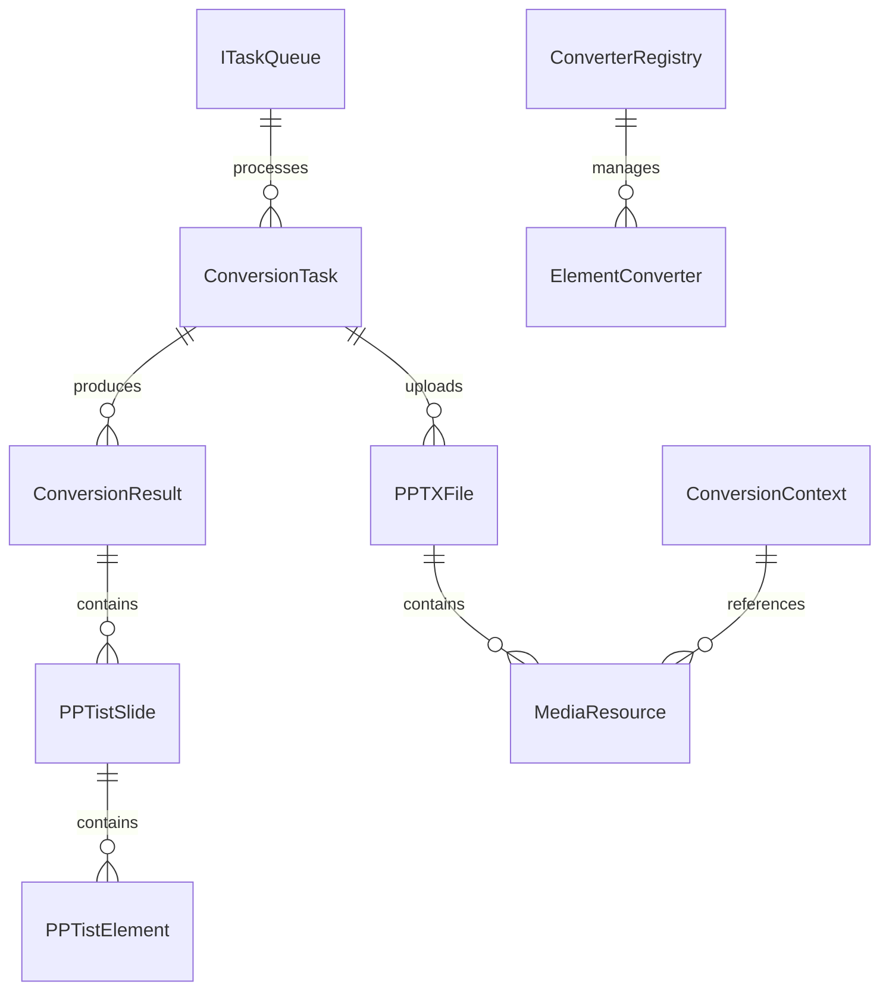

# Data Model

**Feature**: PPTX to JSON Conversion
**Date**: 2026-01-24
**Status**: ✅ Complete

## Overview

本文档定义 PPTX 到 JSON 转换系统的核心数据模型，包括实体定义、字段规格、验证规则和状态转换。

---

## Core Entities

### 1. ConversionTask (转换任务)

**描述**: 表示单个 PPTX 文件的转换任务，包含任务状态、进度、结果等。

**TypeScript Definition**:
```typescript
interface ConversionTask {
  // 核心标识
  taskId: string;              // UUID v4，任务唯一标识

  // 文件信息
  filename: string;            // 原始文件名（e.g., "presentation.pptx"）
  fileSize: number;            // 文件大小（bytes）

  // 任务状态
  status: TaskStatus;          // 任务当前状态
  progress: number;            // 进度百分比（0-100）

  // 转换参数
  targetVersion: string;       // 目标 PPTist 版本（e.g., "v1", "v2"）

  // 时间戳
  createdAt: Date;             // 任务创建时间
  startedAt?: Date;            // 任务开始时间
  completedAt?: Date;          // 任务完成时间

  // 结果（仅当 status = 'completed' 时存在）
  result?: ConversionResult;

  // 错误信息（仅当 status = 'failed' 时存在）
  error?: {
    code: string;              // 错误码（e.g., "INVALID_FORMAT", "PARSE_ERROR"）
    message: string;           // 错误消息
    details?: any;             // 错误详情（开发环境）
  };
}

enum TaskStatus {
  QUEUED = 'queued',           // 排队中
  PROCESSING = 'processing',   // 处理中
  COMPLETED = 'completed',     // 已完成
  FAILED = 'failed'            // 失败
}
```

**Zod Validation Schema**:
```typescript
import { z } from 'zod';

export const ConversionTaskSchema = z.object({
  taskId: z.string().uuid(),
  filename: z.string().max(255),
  fileSize: z.number().int().positive().max(100 * 1024 * 1024), // max 100MB
  status: z.enum(['queued', 'processing', 'completed', 'failed']),
  progress: z.number().min(0).max(100),
  targetVersion: z.string().regex(/^v\d+$/),
  createdAt: z.date(),
  startedAt: z.date().optional(),
  completedAt: z.date().optional(),
  result: z.any().optional(),
  error: z.object({
    code: z.string(),
    message: z.string(),
    details: z.any().optional()
  }).optional()
});
```

**State Transitions**:
```
[创建] → QUEUED → PROCESSING → COMPLETED
                ↓
              FAILED
```

---

### 2. ConversionResult (转换结果)

**描述**: 转换任务的输出结果，包含 JSON 数据、元数据、警告信息。

**TypeScript Definition**:
```typescript
interface ConversionResult {
  // 核心数据
  slides: PPTistSlide[];       // PPTist 格式的幻灯片数组

  // 元数据
  metadata: ConversionMetadata;

  // 转换警告
  warnings: ConversionWarning[];

  // 版本信息
  pptistVersion: string;       // 输出对应的 PPTist 版本
}

interface PPTistSlide {
  id: string;                  // 幻灯片 ID
  elements: PPTistElement[];   // 元素数组
  background: SlideBackground; // 背景设置
  notes?: string;              // 备注
  remark?: string;             // 备注（PPTist 特有）
}

interface ConversionMetadata {
  slideCount: number;          // 幻灯片总数
  elementStats: {              // 元素统计
    text: number;
    image: number;
    shape: number;
    line: number;
    chart: number;
    table: number;
    video: number;
    audio: number;
  };
  processingDuration: number;  // 处理时长（ms）
  fileSize: number;            // 原始文件大小（bytes）
  targetVersion: string;       // 目标版本
  extractedMedia: {            // 提取的媒体文件
    images: string[];          // 图片文件名数组
    videos: string[];          // 视频文件名数组
    audios: string[];          // 音频文件名数组
  };
}

interface ConversionWarning {
  type: string;                // 警告类型（e.g., "UNSUPPORTED_ELEMENT", "DOWNGRADED"）
  elementId?: string;          // 受影响的元素 ID
  message: string;             // 警告消息
  suggestion?: string;         // 建议操作
}
```

**Zod Validation Schema**:
```typescript
export const ConversionResultSchema = z.object({
  slides: z.array(z.any()),    // PPTistSlide 复杂对象，使用 any
  metadata: z.object({
    slideCount: z.number().int().positive(),
    elementStats: z.object({
      text: z.number().int().nonnegative(),
      image: z.number().int().nonnegative(),
      shape: z.number().int().nonnegative(),
      line: z.number().int().nonnegative(),
      chart: z.number().int().nonnegative(),
      table: z.number().int().nonnegative(),
      video: z.number().int().nonnegative(),
      audio: z.number().int().nonnegative()
    }),
    processingDuration: z.number().int().positive(),
    fileSize: z.number().int().positive(),
    targetVersion: z.string(),
    extractedMedia: z.object({
      images: z.array(z.string()),
      videos: z.array(z.string()),
      audios: z.array(z.string())
    })
  }),
  warnings: z.array(z.object({
    type: z.string(),
    elementId: z.string().optional(),
    message: z.string(),
    suggestion: z.string().optional()
  })),
  pptistVersion: z.string()
});
```

---

### 3. PPTXFile (PPTX 文件)

**描述**: 表示上传的 PowerPoint 文件，用于文件验证和元数据提取。

**TypeScript Definition**:
```typescript
interface PPTXFile {
  // 文件基本信息
  originalName: string;       // 原始文件名
  buffer: Buffer;              // 文件二进制数据
  size: number;                // 文件大小（bytes）
  mimeType: string;            // MIME 类型（"application/vnd.openxmlformats-officedocument.presentationml.presentation"）

  // 验证信息
  isValid: boolean;            // 是否为有效的 PPTX 格式
  validationError?: string;    // 验证错误消息（如果无效）
}
```

**Zod Validation Schema**:
```typescript
export const PPTXFileSchema = z.object({
  originalName: z.string()
    .max(255)
    .regex(/\.pptx$/i, "文件扩展名必须是 .pptx"),
  buffer: z.instanceof(Buffer),
  size: z.number()
    .int()
    .positive()
    .max(100 * 1024 * 1024, "文件大小不能超过 100MB"),
  mimeType: z.literal("application/vnd.openxmlformats-officedocument.presentationml.presentation"),
  isValid: z.boolean(),
  validationError: z.string().optional()
});
```

---

### 4. MediaResource (媒体资源)

**描述**: PPTX 中嵌入的媒体文件（图片、音频、视频），包含原始数据和转换后的格式。

**TypeScript Definition**:
```typescript
interface MediaResource {
  // 原始信息
  originalPath: string;        // PPTX 内路径（e.g., "ppt/media/image1.png"）
  fileName: string;            // 提取后的文件名（UUID + 扩展名）
  size: number;                // 文件大小（bytes）
  mimeType: string;            // MIME 类型

  // 存储方式
  storageType: 'base64' | 'file'; // 存储类型
  data?: string;               // base64 编码（如果 storageType = 'base64'）
  filePath?: string;           // 文件路径（如果 storageType = 'file'）

  // 关联信息
  elementId: string;           // 关联的 PPTist 元素 ID
}
```

**Zod Validation Schema**:
```typescript
export const MediaResourceSchema = z.object({
  originalPath: z.string(),
  fileName: z.string().regex(/^[a-f0-9-]+\.(png|jpg|jpeg|gif|mp4|mp3|wav)$/i),
  size: z.number().int().positive(),
  mimeType: z.string(),
  storageType: z.enum(['base64', 'file']),
  data: z.string().base64().optional(),
  filePath: z.string().optional(),
  elementId: z.string()
}).refine(data => {
  // 验证 storageType 与对应字段存在性
  if (data.storageType === 'base64') return !!data.data;
  if (data.storageType === 'file') return !!data.filePath;
  return false;
}, {
  message: "storageType 必须与对应的 data 或 filePath 字段匹配"
});
```

---

### 5. ElementConverter (元素转换器接口)

**描述**: 转换器接口，定义 PPTX 元素到 PPTist 元素的转换契约。

**TypeScript Definition**:
```typescript
interface ElementConverter<TInput = any, TOutput = any> {
  // 类型检查
  canConvert(elementType: string): boolean;

  // 转换方法
  convert(
    element: TInput,
    context: ConversionContext
  ): TOutput;

  // 优先级（用于注册表排序）
  priority?: number;
}

interface ConversionContext {
  // 转换参数
  targetVersion: string;       // 目标 PPTist 版本

  // 坐标系信息
  slideWidth: number;          // 幻灯片宽度（EMU 单位）
  slideHeight: number;         // 幻灯片高度（EMU 单位）

  // 辅助数据
  mediaMap: Map<string, MediaResource>;  // 媒体资源映射

  // 警告收集
  warnings: ConversionWarning[];
}
```

**TypeScript Interface**:
```typescript
// types/converters.ts
export interface IElementConverter<TInput, TOutput> {
  canConvert(elementType: string): boolean;
  convert(element: TInput, context: IConversionContext): TOutput;
  priority?: number;
}

export interface IConversionContext {
  targetVersion: string;
  slideWidth: number;
  slideHeight: number;
  mediaMap: Map<string, IMediaResource>;
  warnings: IConversionWarning[];
}

export type ConverterConstructor = new () => IElementConverter<any, any>;
```

---

### 6. ConverterRegistry (转换器注册表)

**描述**: 维护元素类型到转换器的映射关系，支持注册、查找、优先级管理。

**TypeScript Definition**:
```typescript
interface ConverterRegistry {
  // 注册转换器
  register(converter: ElementConverter): void;

  // 查找转换器
  find(elementType: string): ElementConverter | null;

  // 获取所有转换器
  getAll(): ElementConverter[];

  // 清空注册表（测试用）
  clear(): void;
}

interface RegistryEntry {
  converter: ElementConverter;
  priority: number;
}
```

---

### 7. ITaskQueue (任务队列接口)

**描述**: 任务队列抽象接口，支持可插拔的存储实现（内存/Redis）。

**TypeScript Definition**:
```typescript
interface ITaskQueue<TTask = any> {
  // 添加任务
  enqueue(task: TTask): Promise<string>;  // 返回 taskId

  // 获取任务状态
  getStatus(taskId: string): Promise<TaskStatus>;

  // 获取任务结果
  getResult(taskId: string): Promise<ConversionResult | null>;

  // 删除任务
  remove(taskId: string): Promise<void>;

  // 队列统计
  getStats(): Promise<QueueStats>;
}

interface QueueStats {
  total: number;               // 总任务数
  queued: number;              // 排队中
  processing: number;          // 处理中
  completed: number;           // 已完成
  failed: number;              // 失败
}
```

---

## Relationships



---

## Validation Rules Summary

| Entity | Key Validations |
|--------|----------------|
| **ConversionTask** | taskId: UUID, filename: max 255 chars, fileSize: ≤ 100MB, progress: 0-100 |
| **PPTXFile** | extension: .pptx, size: ≤ 100MB, mimeType: application/vnd.openxmlformats-officedocument.presentationml.presentation |
| **MediaResource** | fileName: UUID + extension, size: > 0, storageType: base64/file with matching field |
| **ElementConverter** | must implement canConvert() and convert() methods |
| **ITaskQueue** | all methods return Promise, taskId format validation |

---

## Storage Strategy

### In-Memory Storage (Default)

**ConversionTask Store**:
```typescript
class InMemoryTaskStore {
  private tasks: Map<string, TaskState>;

  // 24 小时后自动清理
  cleanupExpiredTasks(): void {
    const now = Date.now();
    const retention = 24 * 60 * 60 * 1000; // 24h

    for (const [taskId, state] of this.tasks) {
      if (state.completedAt &&
          (now - state.completedAt.getTime()) > retention) {
        this.tasks.delete(taskId);
      }
    }
  }
}
```

### File Storage (Extracted Media)

**Directory Structure**:
```
/tmp/pptx-conversion/
├── {taskId}/
│   ├── presentation.json      # 转换结果 JSON
│   ├── media/
│   │   ├── image-{uuid}.png
│   │   ├── video-{uuid}.mp4
│   │   └── audio-{uuid}.mp3
│   └── .metadata              # 元数据（JSON）
```

**Cleanup Policy**:
- 结果保留：24 小时（可配置）
- 定时清理：每小时执行一次
- 下载后：可选立即删除

---

## Next Steps

1. ✅ Data Model 完成
2. ⏭️ 生成 API 契约（OpenAPI 规范）
3. ⏭️ 生成快速开始指南

**Status**: Ready for API Contract Design → Continue Phase 1.
